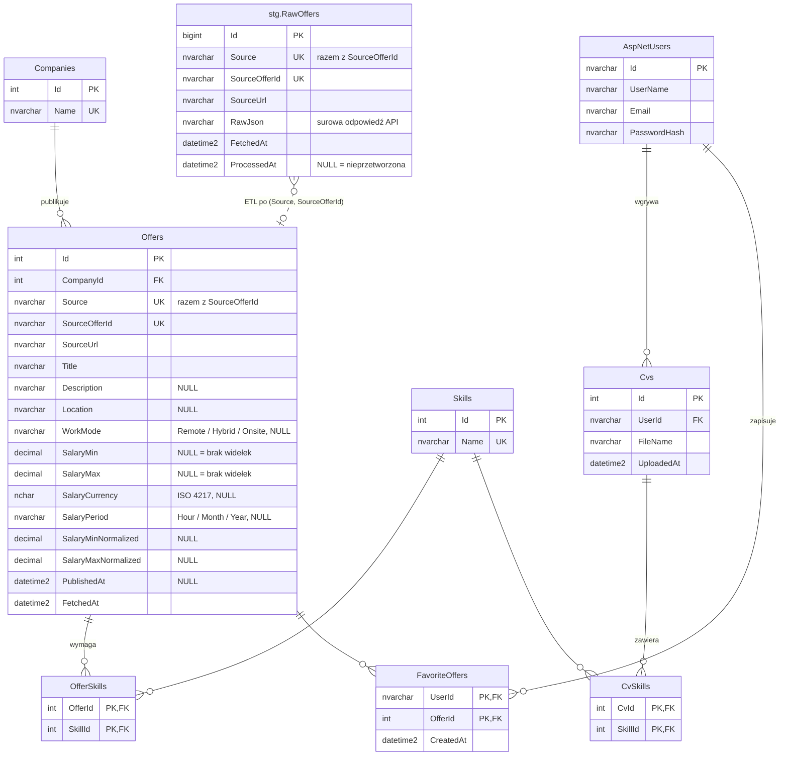

#Schemat bazy danych RynekIT

Diagram aktualny dla migracji `InitialSchema`. Tabele ASP.NET Core Identity pominięte, poza `AspNetUsers`.

```mermaid
erDiagram
    Companies ||--o{ Offers : "publikuje"
    Offers ||--o{ OfferSkills : "wymaga"
    Skills ||--o{ OfferSkills : ""
    AspNetUsers ||--o{ Cvs : "wgrywa"
    Cvs ||--o{ CvSkills : "zawiera"
    Skills ||--o{ CvSkills : ""
    AspNetUsers ||--o{ FavoriteOffers : "zapisuje"
    Offers ||--o{ FavoriteOffers : ""
    RawOffers }o..o| Offers : "ETL po (Source, SourceOfferId)"

    Companies {
        int Id PK
        nvarchar Name UK
    }
    Offers {
        int Id PK
        int CompanyId FK
        nvarchar Source UK "razem z SourceOfferId"
        nvarchar SourceOfferId UK
        nvarchar SourceUrl
        nvarchar Title
        nvarchar Description "NULL"
        nvarchar Location "NULL"
        nvarchar WorkMode "Remote / Hybrid / Onsite, NULL"
        decimal SalaryMin "NULL = brak widełek"
        decimal SalaryMax "NULL = brak widełek"
        nchar SalaryCurrency "ISO 4217, NULL"
        nvarchar SalaryPeriod "Hour / Month / Year, NULL"
        decimal SalaryMinNormalized "NULL"
        decimal SalaryMaxNormalized "NULL"
        datetime2 PublishedAt "NULL"
        datetime2 FetchedAt
    }
    Skills {
        int Id PK
        nvarchar Name UK
    }
    OfferSkills {
        int OfferId PK, FK
        int SkillId PK, FK
    }
    AspNetUsers {
        nvarchar Id PK
        nvarchar UserName
        nvarchar Email
        nvarchar PasswordHash
    }
    Cvs {
        int Id PK
        nvarchar UserId FK
        nvarchar FileName
        datetime2 UploadedAt
    }
    CvSkills {
        int CvId PK, FK
        int SkillId PK, FK
    }
    FavoriteOffers {
        nvarchar UserId PK, FK
        int OfferId PK, FK
        datetime2 CreatedAt
    }
    RawOffers["stg.RawOffers"] {
        bigint Id PK
        nvarchar Source UK "razem z SourceOfferId"
        nvarchar SourceOfferId UK
        nvarchar SourceUrl
        nvarchar RawJson "surowa odpowiedź API"
        datetime2 FetchedAt
        datetime2 ProcessedAt "NULL = nieprzetworzona"
    }
```